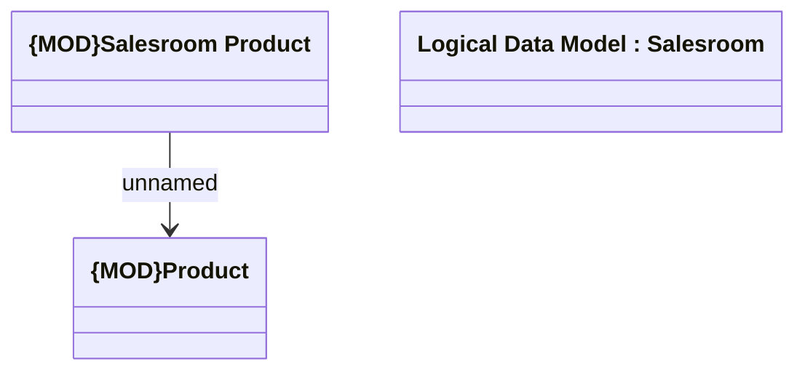

# Salesroom to product

```mermaid
classDiagram
    class MOD_Product["{MOD}Product"]
    class MOD_Salesroom_Product["{MOD}Salesroom Product"]
    class Logical_Data_Model_Salesroom["Logical Data Model : Salesroom"]
    MOD_Salesroom_Product --> MOD_Product : unnamed
```
