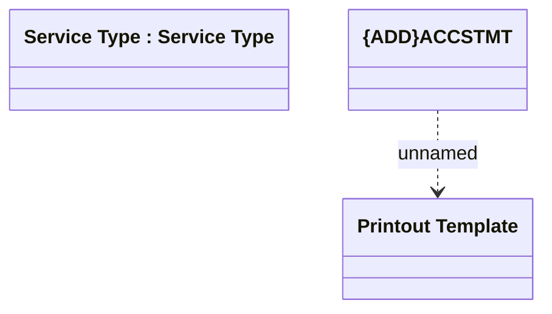

# ACCSTMT

- **Diagram Type**: Logical
- **Package**: HomerSelect/BSL/Modules/Product Catalog (PRC)/Analytical Model/Service Catalog/COMMON for Service Catalog/Logical Data Model/Service Type/ACCSTMT
- **Diagram ID**: 157944
- **Elements**: 3
- **Connectors**: 1

