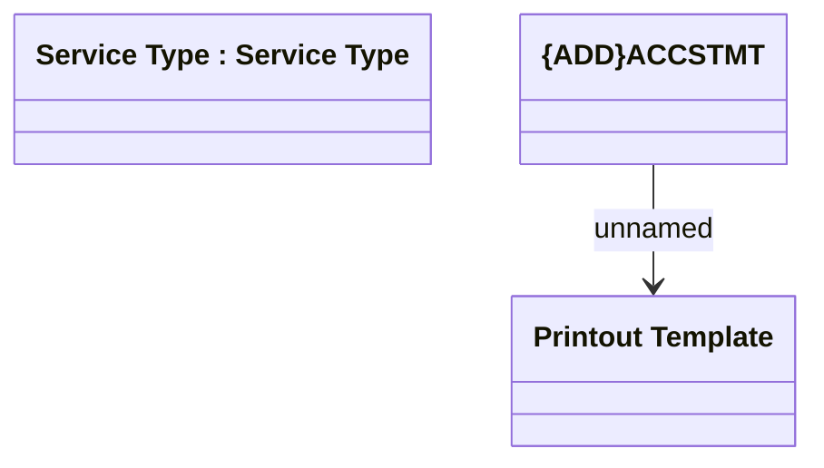

# ACCSTMT

```mermaid
classDiagram
    class Printout_Template["Printout Template"]
    class Service_Type_Service_Type["Service Type : Service Type"]
    class ADD_ACCSTMT["{ADD}ACCSTMT"]
    ADD_ACCSTMT --> Printout_Template : unnamed
```
