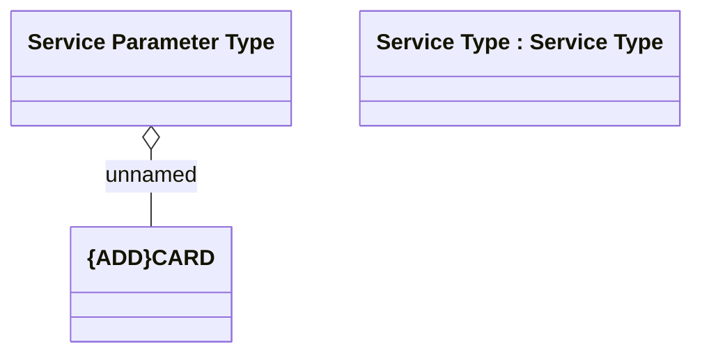

# CARD

- **Diagram Type**: Logical
- **Package**: HomerSelect/BSL/Modules/Product Catalog (PRC)/Analytical Model/Service Catalog/COMMON for Service Catalog/Logical Data Model/Service Type/CARD
- **Diagram ID**: 156740
- **Elements**: 3
- **Connectors**: 1

