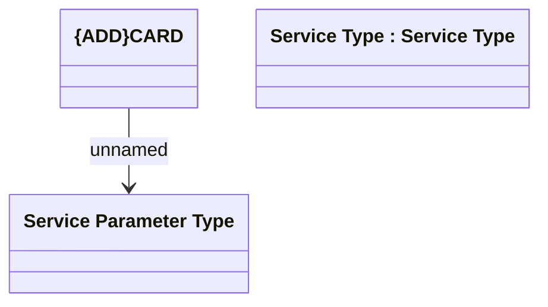

# CARD

```mermaid
classDiagram
    class ADD_CARD["{ADD}CARD"]
    class Service_Type_Service_Type["Service Type : Service Type"]
    class Service_Parameter_Type["Service Parameter Type"]
    ADD_CARD --> Service_Parameter_Type : unnamed
```
