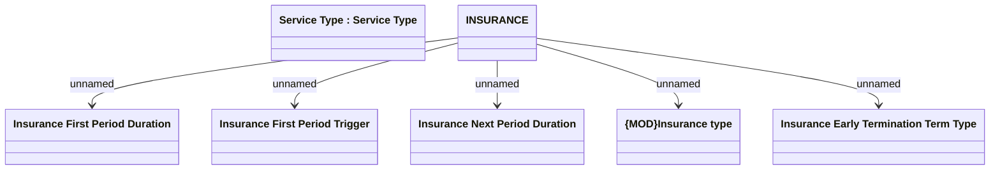

# INSURANCE

```mermaid
classDiagram
    class Insurance_Early_Termination_Term_Type["Insurance Early Termination Term Type"]
    class MOD_Insurance_type["{MOD}Insurance type"]
    class Insurance_Next_Period_Duration["Insurance Next Period Duration"]
    class Insurance_First_Period_Trigger["Insurance First Period Trigger"]
    class Insurance_First_Period_Duration["Insurance First Period Duration"]
    class Service_Type_Service_Type["Service Type : Service Type"]
    class INSURANCE["INSURANCE"]
    INSURANCE --> Insurance_First_Period_Duration : unnamed
    INSURANCE --> Insurance_First_Period_Trigger : unnamed
    INSURANCE --> Insurance_Next_Period_Duration : unnamed
    INSURANCE --> MOD_Insurance_type : unnamed
    INSURANCE --> Insurance_Early_Termination_Term_Type : unnamed
```
