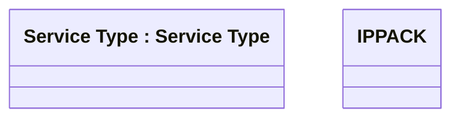

# IPPACK

- **Diagram Type**: Logical
- **Package**: HomerSelect/BSL/Modules/Product Catalog (PRC)/Analytical Model/Service Catalog/COMMON for Service Catalog/Logical Data Model/Service Type/IPPACK
- **Diagram ID**: 145265
- **Elements**: 2
- **Connectors**: 0

