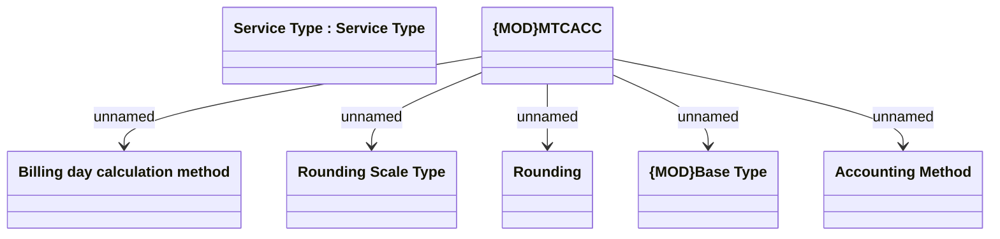

# MTCACC

```mermaid
classDiagram
    class Accounting_Method["Accounting Method"]
    class Service_Type_Service_Type["Service Type : Service Type"]
    class MOD_Base_Type["{MOD}Base Type"]
    class Rounding["Rounding"]
    class Rounding_Scale_Type["Rounding Scale Type"]
    class Billing_day_calculation_method["Billing day calculation method"]
    class MOD_MTCACC["{MOD}MTCACC"]
    MOD_MTCACC --> Billing_day_calculation_method : unnamed
    MOD_MTCACC --> Rounding_Scale_Type : unnamed
    MOD_MTCACC --> Rounding : unnamed
    MOD_MTCACC --> MOD_Base_Type : unnamed
    MOD_MTCACC --> Accounting_Method : unnamed
```
