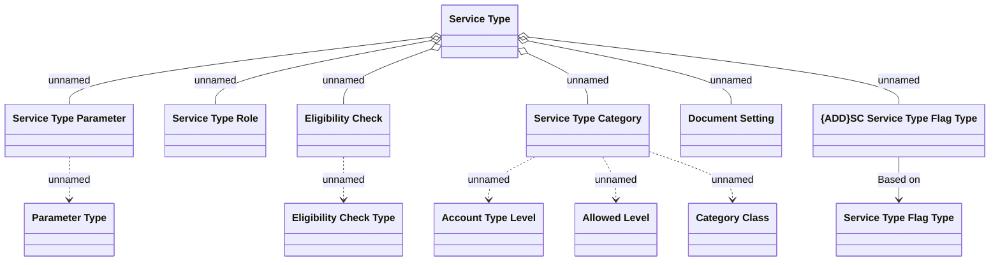

# Service Type Structure

- **Diagram Type**: Logical
- **Package**: HomerSelect/BSL/Modules/Product Catalog (PRC)/Analytical Model/Service Catalog/COMMON for Service Catalog/Logical Data Model
- **Diagram ID**: 161114
- **Elements**: 13
- **Connectors**: 12

