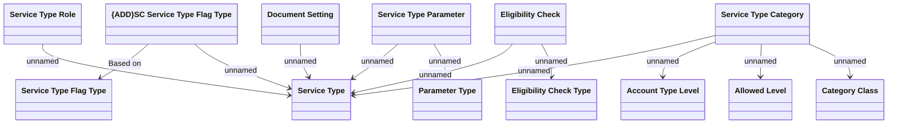

# Service Type Structure

```mermaid
classDiagram
    class ADD_SC_Service_Type_Flag_Type["{ADD}SC Service Type Flag Type"]
    class Service_Type_Flag_Type["Service Type Flag Type"]
    class Service_Type_Role["Service Type Role"]
    class Parameter_Type["Parameter Type"]
    class Service_Type_Parameter["Service Type Parameter"]
    class Eligibility_Check_Type["Eligibility Check Type"]
    class Eligibility_Check["Eligibility Check"]
    class Document_Setting["Document Setting"]
    class Category_Class["Category Class"]
    class Allowed_Level["Allowed Level"]
    class Account_Type_Level["Account Type Level"]
    class Service_Type_Category["Service Type Category"]
    class Service_Type["Service Type"]
    ADD_SC_Service_Type_Flag_Type --> Service_Type_Flag_Type : Based on
    Service_Type_Role --> Service_Type : unnamed
    Service_Type_Parameter --> Service_Type : unnamed
    Eligibility_Check --> Service_Type : unnamed
    Document_Setting --> Service_Type : unnamed
    Service_Type_Category --> Service_Type : unnamed
    ADD_SC_Service_Type_Flag_Type --> Service_Type : unnamed
    Service_Type_Category --> Account_Type_Level : unnamed
    Service_Type_Category --> Allowed_Level : unnamed
    Service_Type_Category --> Category_Class : unnamed
    Eligibility_Check --> Eligibility_Check_Type : unnamed
    Service_Type_Parameter --> Parameter_Type : unnamed
```
