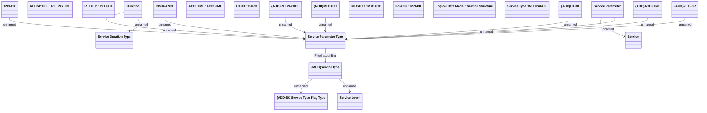

# Service Type

```mermaid
classDiagram
    class ADD_SC_Service_Type_Flag_Type["{ADD}SC Service Type Flag Type"]
    class ADD_RELPAYHOL["{ADD}RELPAYHOL"]
    class RELPAYHOL_RELPAYHOL["RELPAYHOL : RELPAYHOL"]
    class RELFER_RELFER["RELFER : RELFER"]
    class ADD_RELFER["{ADD}RELFER"]
    class ADD_ACCSTMT["{ADD}ACCSTMT"]
    class ACCSTMT_ACCSTMT["ACCSTMT : ACCSTMT"]
    class CARD_CARD["CARD : CARD"]
    class ADD_CARD["{ADD}CARD"]
    class MOD_MTCACC["{MOD}MTCACC"]
    class MTCACC_MTCACC["MTCACC : MTCACC"]
    class Service_Level["Service Level"]
    class IPPACK_IPPACK["IPPACK : IPPACK"]
    class MOD_Service_type["{MOD}Service type"]
    class Logical_Data_Model_Service_Structure["Logical Data Model : Service Structure"]
    class Service_Type_INSURANCE["Service Type :INSURANCE"]
    class INSURANCE["INSURANCE"]
    class Service_Duration_Type["Service Duration Type"]
    class Duration["Duration"]
    class Service_Parameter_Type["Service Parameter Type"]
    class Service_Parameter["Service Parameter"]
    class IPPACK["IPPACK"]
    class Service["Service"]
    MOD_Service_type --> ADD_SC_Service_Type_Flag_Type : unnamed
    Service_Parameter --> Service : unnamed
    IPPACK --> Service_Parameter_Type : unnamed
    INSURANCE --> Service_Parameter_Type : unnamed
    Duration --> Service_Parameter_Type : unnamed
    Service_Parameter --> Service_Parameter_Type : unnamed
    ADD_RELPAYHOL --> Service_Parameter_Type : unnamed
    MOD_MTCACC --> Service_Parameter_Type : unnamed
    ADD_CARD --> Service_Parameter_Type : unnamed
    ADD_ACCSTMT --> Service_Parameter_Type : unnamed
    ADD_RELFER --> Service_Parameter_Type : unnamed
    Duration --> Service_Duration_Type : unnamed
    Service_Parameter_Type --> MOD_Service_type : Filled according
    MOD_Service_type --> Service_Level : unnamed
```
