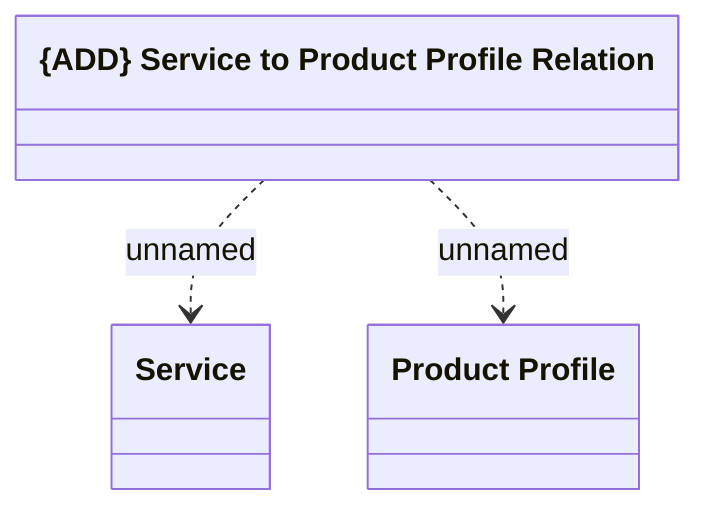

# Logical Data Model

- **Diagram Type**: Logical
- **Package**: HomerSelect/BSL/Modules/Product Catalog (PRC)/Analytical Model/Service to Product profile/COMMON for Service to Product profile/Logical Data Model
- **Diagram ID**: 162966
- **Elements**: 3
- **Connectors**: 2

