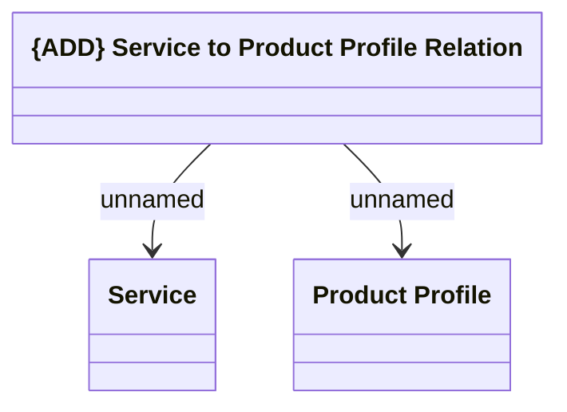

# Logical Data Model

```mermaid
classDiagram
    class ADD_Service_to_Product_Profile_Relation["{ADD} Service to Product Profile Relation"]
    class Product_Profile["Product Profile"]
    class Service["Service"]
    ADD_Service_to_Product_Profile_Relation --> Service : unnamed
    ADD_Service_to_Product_Profile_Relation --> Product_Profile : unnamed
```
