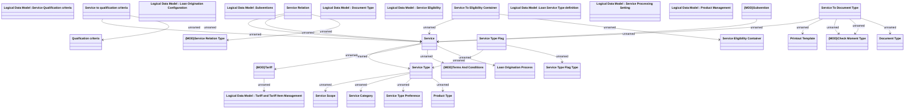

# Loan Service Structure

```mermaid
classDiagram
    class Logical_Data_Model_Service_Qualification_criteria["Logical Data Model :Service Qualification criteria"]
    class Quaification_criteria["Quaification criteria"]
    class Service_to_qualification_criteria["Service to qualification criteria"]
    class Logical_Data_Model_Loan_Origination_Configuration["Logical Data Model : Loan Origination Configuration"]
    class Loan_Origination_Process["Loan Origination Process"]
    class Logical_Data_Model_Subventions["Logical Data Model :Subventions"]
    class MOD_Subvention["{MOD}Subvention"]
    class MOD_Service_Relation_Type["{MOD}Service Relation Type"]
    class Logical_Data_Model_Document_Type["Logical Data Model : Document Type"]
    class Logical_Data_Model_Service_Eligibility["Logical Data Model : Service Eligibility"]
    class Service_To_Eligibility_Container["Service To Eligibility Container"]
    class Service_Eligibility_Container["Service Eligibility Container"]
    class Service_Type_Flag_Type["Service Type Flag Type"]
    class Service_Type_Flag["Service Type Flag"]
    class Logical_Data_Model_Loan_Service_Type_definition["Logical Data Model :Loan Service Type definition"]
    class Product_Type["Product Type"]
    class Service_Type_Preference["Service Type Preference"]
    class Logical_Data_Model_Service_Processing_Setting["Logical Data Model : Service Processing Setting"]
    class Logical_Data_Model_Tariff_and_Tariff_Item_Management["Logical Data Model : Tariff and Tariff Item Management"]
    class Logical_Data_Model_Product_Management["Logical Data Model : Product Management"]
    class MOD_Check_Moment_Type["{MOD}Check Moment Type"]
    class Service_Relation["Service Relation"]
    class Service_Scope["Service Scope"]
    class MOD_Terms_And_Conditions["{MOD}Terms And Conditions"]
    class Service_To_Document_Type["Service To Document Type"]
    class Document_Type["Document Type"]
    class Printout_Template["Printout Template"]
    class MOD_Tariff["{MOD}Tariff"]
    class Service_Category["Service Category"]
    class Service["Service"]
    class Service_Type["Service Type"]
    Service_To_Document_Type --> Document_Type : unnamed
    Service --> Loan_Origination_Process : unnamed
    Service_Relation --> MOD_Service_Relation_Type : unnamed
    Service_To_Eligibility_Container --> Service_Eligibility_Container : unnamed
    Service_Type_Flag --> Service_Type_Flag_Type : unnamed
    Service_Type --> Product_Type : unnamed
    Service_Type --> Service_Type_Preference : unnamed
    MOD_Tariff --> Logical_Data_Model_Tariff_and_Tariff_Item_Management : unnamed
    Service_To_Document_Type --> MOD_Check_Moment_Type : unnamed
    Service_To_Document_Type --> MOD_Check_Moment_Type : unnamed
    Service_to_qualification_criteria --> Quaification_criteria : unnamed
    Service --> MOD_Terms_And_Conditions : unnamed
    Service_Type_Flag --> Service_Type : unnamed
    Service_To_Document_Type --> Printout_Template : unnamed
    Service --> MOD_Tariff : unnamed
    Service_Type --> Service_Category : unnamed
    Service_Relation --> Service : unnamed
    Service_To_Eligibility_Container --> Service : unnamed
    MOD_Subvention --> Service : unnamed
    Service_To_Document_Type --> Service : unnamed
    Service_Relation --> Service : unnamed
    Service_to_qualification_criteria --> Service : unnamed
    Service --> Service_Type : unnamed
    Service_Type --> Service_Scope : unnamed
```
