# Loan Service Type definition

- **Diagram Type**: Logical
- **Package**: HomerSelect/BSL/Modules/Product Catalog (PRC)/Analytical Model/Service/COMMON for Service/Logical Data Model
- **Diagram ID**: 164603
- **Elements**: 45
- **Connectors**: 1

```mermaid
classDiagram
    class IBACK_IBACK["IBACK : IBACK"]
    class SALPROOF_SALPROOF["SALPROOF : SALPROOF"]
    class TOPUP_TOPUP["TOPUP : TOPUP"]
    class PAYM_Payment_service_Settings["PAYM :Payment service - Settings"]
    class diagram_145ED5DB_BACA_4583_9083_A4BF558BC787["$diagram://{145ED5DB-BACA-4583-9083-A4BF558BC787}"]
    class diagram_AD867718_3047_4bd4_8A87_3A89FDE968BE["$diagram://{AD867718-3047-4bd4-8A87-3A89FDE968BE}"]
    class ACCSTMT_ACCSTMT["ACCSTMT : ACCSTMT"]
    class diagram_50EF8C8A_EFEE_4550_ABEF_803F972982F5["$diagram://{50EF8C8A-EFEE-4550-ABEF-803F972982F5}"]
    class RELFER_RELFER["RELFER : RELFER"]
    class IPPACK_Installment_Plan_Pack_Setting["IPPACK :Installment Plan Pack - Setting"]
    class Logical_Data_Model_CEL_Rewards_Setting["Logical Data Model : CEL Rewards - Setting"]
    class diagram_16564E8D_2716_427b_B9A3_E1568541D6CB["$diagram://{16564E8D-2716-427b-B9A3-E1568541D6CB}"]
    class diagram_9D366A75_CCEC_4686_9EF3_7ED3CE99BC04["$diagram://{9D366A75-CCEC-4686-9EF3-7ED3CE99BC04}"]
    class Logical_Data_Model_Checking_Terms_of_Loan_setting["Logical Data Model : Checking Terms of Loan setting"]
    class Logical_Data_Model_Change_of_Due_Date_with_Request["Logical Data Model : Change of Due Date with Request"]
    class Logical_Data_Model_Loan_Service_Structure["Logical Data Model :Loan Service Structure"]
    class Logical_Data_Model_Payment_Holidays_Settting["Logical Data Model : Payment Holidays - Settting"]
    class diagram_E4143B50_2542_4020_A6B1_113DE08AC29E["$diagram://{E4143B50-2542-4020-A6B1-113DE08AC29E}"]
    class Logical_Data_Model_Installment_Plan_for_REL_transaction_para["Logical Data Model : Installment Plan for REL transaction - parameters"]
    class MOD_Service_Type_Definition["{MOD}Service Type Definition"]
    class Logical_Data_Model_Partial_early_repayment_setting["Logical Data Model : Partial early repayment setting"]
    class Logical_Data_Model_Zero_promo_for_REL["Logical Data Model : Zero promo for REL"]
    class Logical_Data_Model_SMS_Notification["Logical Data Model : SMS Notification"]
    class Logical_Data_Model_Contract_Early_Termination_Setting["Logical Data Model : Contract Early Termination Setting"]
    class Logical_Data_Model_Standard_Payment_Card["Logical Data Model : Standard Payment Card"]
    class Logical_Data_Model_Grace_period_for_REL["Logical Data Model : Grace period for REL"]
    class Logical_Data_Model_Change_of_Due_Date["Logical Data Model : Change of Due Date"]
    class Logical_Data_Model_Deferred_Payment["Logical Data Model : Deferred Payment"]
    class Logical_Data_Model_Fees_back["Logical Data Model : Fees-back"]
    class Logical_Data_Model_Cooling_off_Period_Service_definition["Logical Data Model : Cooling-off Period Service definition"]
    class Logical_Data_Model_Grace_Period["Logical Data Model : Grace Period"]
    class Logical_Data_Model_Full_Early_Repayment_service["Logical Data Model :Full Early Repayment service"]
    class Logical_Data_Model_Gift_Payment["Logical Data Model :Gift Payment"]
    class Insurance_Service_Insurance_Service["Insurance Service : Insurance Service"]
    class Service_Type["Service Type"]
    class Loan_option_services["Loan option services"]
    class Service_types_specific_setting["Service types - specific setting"]
    class PH_only["PH only"]
    class Mobi_bank_only["Mobi bank only"]
    class Insurance_services["Insurance services"]
    class Standard_payment_card["Standard payment card"]
    Service_Type ..> MOD_Service_Type_Definition : filled from
```

