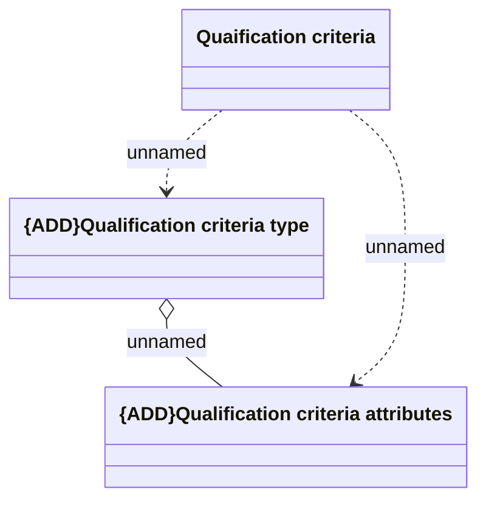

# Service Qualification criteria

- **Diagram Type**: Logical
- **Package**: HomerSelect/BSL/Modules/Product Catalog (PRC)/Analytical Model/Service/COMMON for Service/Logical Data Model
- **Diagram ID**: 164604
- **Elements**: 3
- **Connectors**: 3

