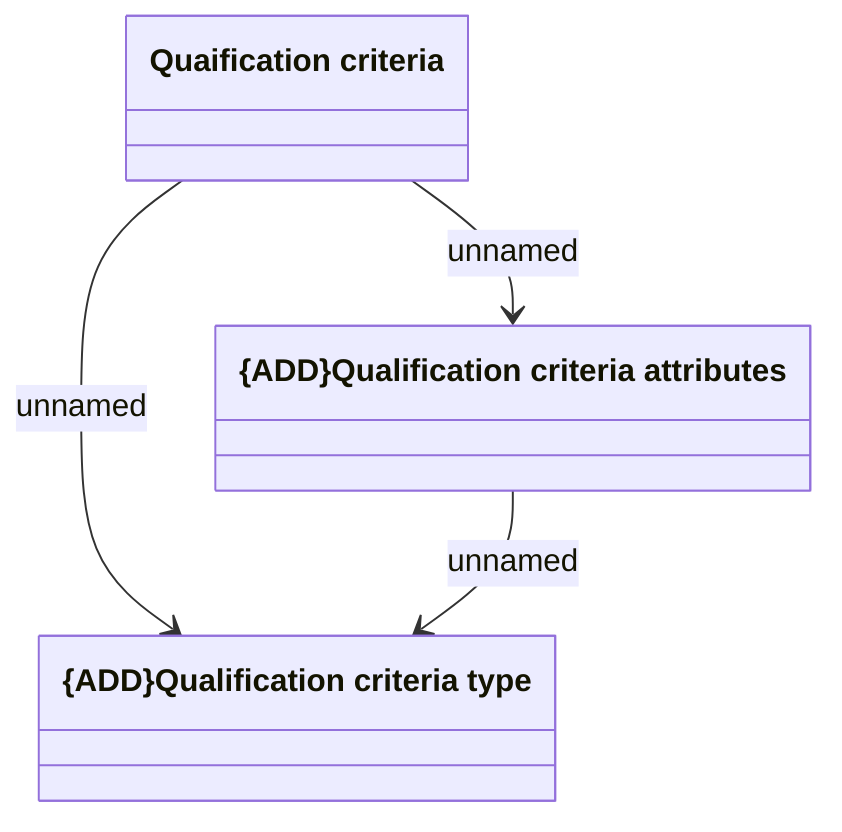

# Service Qualification criteria

```mermaid
classDiagram
    class Quaification_criteria["Quaification criteria"]
    class ADD_Qualification_criteria_attributes["{ADD}Qualification criteria attributes"]
    class ADD_Qualification_criteria_type["{ADD}Qualification criteria type"]
    Quaification_criteria --> ADD_Qualification_criteria_type : unnamed
    ADD_Qualification_criteria_attributes --> ADD_Qualification_criteria_type : unnamed
    Quaification_criteria --> ADD_Qualification_criteria_attributes : unnamed
```
