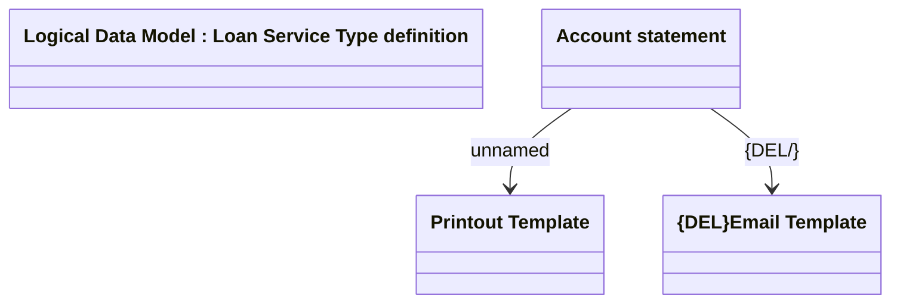

# ACCSTMT

```mermaid
classDiagram
    class DEL_Email_Template["{DEL}Email Template"]
    class Printout_Template["Printout Template"]
    class Logical_Data_Model_Loan_Service_Type_definition["Logical Data Model : Loan Service Type definition"]
    class Account_statement["Account statement"]
    Account_statement --> Printout_Template : unnamed
    Account_statement --> DEL_Email_Template : {DEL/}
```
