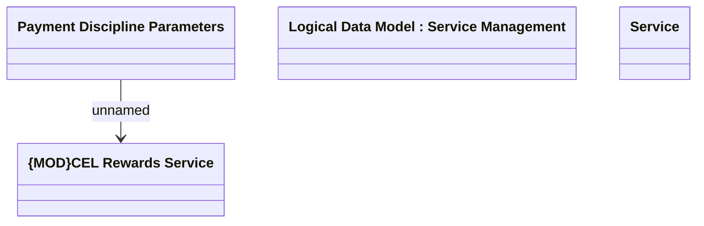

# CEL Rewards - Setting

```mermaid
classDiagram
    class Payment_Discipline_Parameters["Payment Discipline Parameters"]
    class MOD_CEL_Rewards_Service["{MOD}CEL Rewards Service"]
    class Logical_Data_Model_Service_Management["Logical Data Model : Service Management"]
    class Service["Service"]
    Payment_Discipline_Parameters --> MOD_CEL_Rewards_Service : unnamed
```
