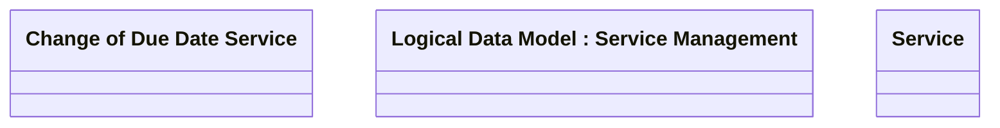

# Change of Due Date

```mermaid
classDiagram
    class Change_of_Due_Date_Service["Change of Due Date Service"]
    class Logical_Data_Model_Service_Management["Logical Data Model : Service Management"]
    class Service["Service"]
```
