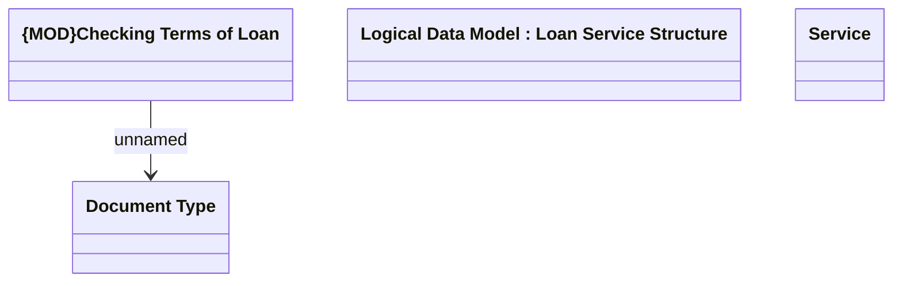

# Checking Terms of Loan setting

```mermaid
classDiagram
    class Document_Type["Document Type"]
    class MOD_Checking_Terms_of_Loan["{MOD}Checking Terms of Loan"]
    class Logical_Data_Model_Loan_Service_Structure["Logical Data Model : Loan Service Structure"]
    class Service["Service"]
    MOD_Checking_Terms_of_Loan --> Document_Type : unnamed
```
