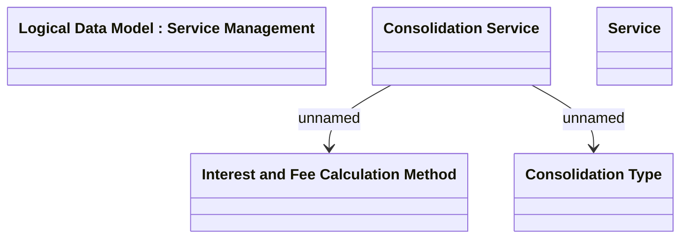

# Consolidation - Setting

```mermaid
classDiagram
    class Logical_Data_Model_Service_Management["Logical Data Model : Service Management"]
    class Consolidation_Type["Consolidation Type"]
    class Interest_and_Fee_Calculation_Method["Interest and Fee Calculation Method"]
    class Consolidation_Service["Consolidation Service"]
    class Service["Service"]
    Consolidation_Service --> Interest_and_Fee_Calculation_Method : unnamed
    Consolidation_Service --> Consolidation_Type : unnamed
```
