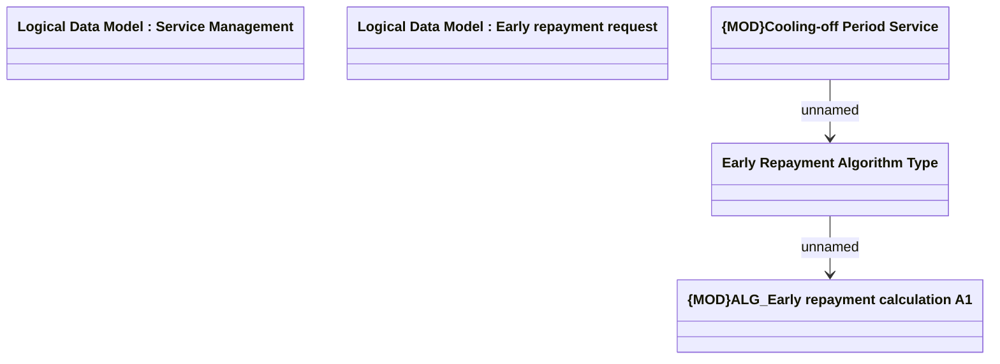

# Cooling-off Period Service definition

```mermaid
classDiagram
    class Logical_Data_Model_Service_Management["Logical Data Model : Service Management"]
    class Logical_Data_Model_Early_repayment_request["Logical Data Model : Early repayment request"]
    class MOD_ALG_Early_repayment_calculation_A1["{MOD}ALG_Early repayment calculation A1"]
    class Early_Repayment_Algorithm_Type["Early Repayment Algorithm Type"]
    class MOD_Cooling_off_Period_Service["{MOD}Cooling-off Period Service"]
    MOD_Cooling_off_Period_Service --> Early_Repayment_Algorithm_Type : unnamed
    Early_Repayment_Algorithm_Type --> MOD_ALG_Early_repayment_calculation_A1 : unnamed
```
