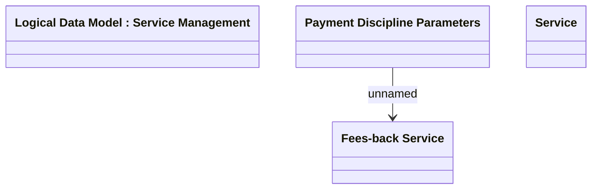

# Fees-back

```mermaid
classDiagram
    class Fees_back_Service["Fees-back Service "]
    class Logical_Data_Model_Service_Management["Logical Data Model : Service Management"]
    class Payment_Discipline_Parameters["Payment Discipline Parameters"]
    class Service["Service"]
    Payment_Discipline_Parameters --> Fees_back_Service : unnamed
```
