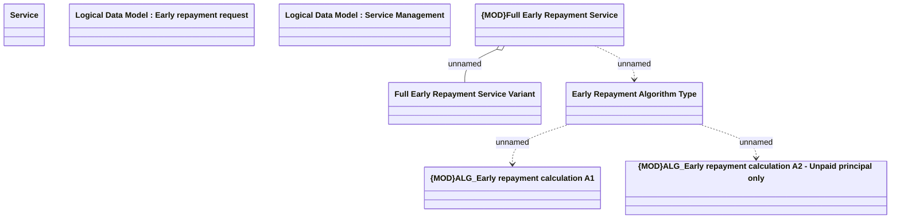

# Full Early Repayment Setting

- **Diagram Type**: Logical
- **Package**: HomerSelect/BSL/Modules/Product Catalog (PRC)/Analytical Model/Service/COMMON for Service/Logical Data Model/Service Type Specific Extension/FER
- **Diagram ID**: 157035
- **Elements**: 8
- **Connectors**: 4

