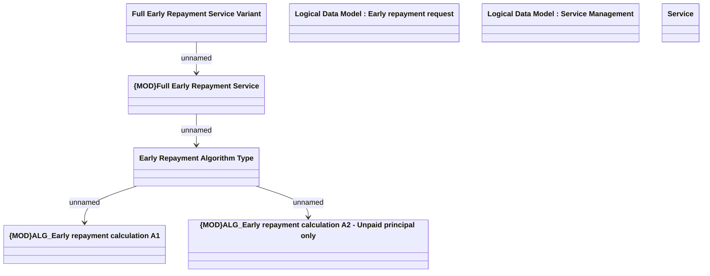

# Full Early Repayment Setting

```mermaid
classDiagram
    class MOD_ALG_Early_repayment_calculation_A2_Unpaid_principal_only["{MOD}ALG_Early repayment calculation A2 - Unpaid principal only"]
    class Full_Early_Repayment_Service_Variant["Full Early Repayment Service Variant"]
    class Logical_Data_Model_Early_repayment_request["Logical Data Model : Early repayment request"]
    class Logical_Data_Model_Service_Management["Logical Data Model : Service Management"]
    class MOD_ALG_Early_repayment_calculation_A1["{MOD}ALG_Early repayment calculation A1"]
    class MOD_Full_Early_Repayment_Service["{MOD}Full Early Repayment Service"]
    class Early_Repayment_Algorithm_Type["Early Repayment Algorithm Type"]
    class Service["Service"]
    MOD_Full_Early_Repayment_Service --> Early_Repayment_Algorithm_Type : unnamed
    Full_Early_Repayment_Service_Variant --> MOD_Full_Early_Repayment_Service : unnamed
    Early_Repayment_Algorithm_Type --> MOD_ALG_Early_repayment_calculation_A1 : unnamed
    Early_Repayment_Algorithm_Type --> MOD_ALG_Early_repayment_calculation_A2_Unpaid_principal_only : unnamed
```
