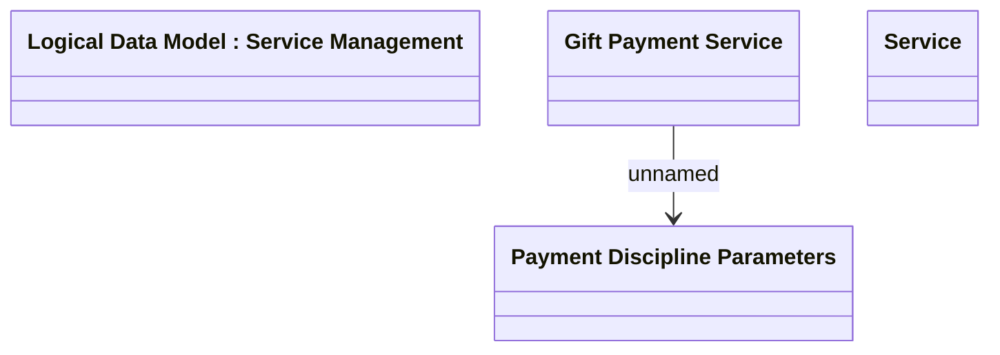

# Gift Payment

```mermaid
classDiagram
    class Logical_Data_Model_Service_Management["Logical Data Model : Service Management"]
    class Payment_Discipline_Parameters["Payment Discipline Parameters"]
    class Gift_Payment_Service["Gift Payment Service "]
    class Service["Service"]
    Gift_Payment_Service --> Payment_Discipline_Parameters : unnamed
```
