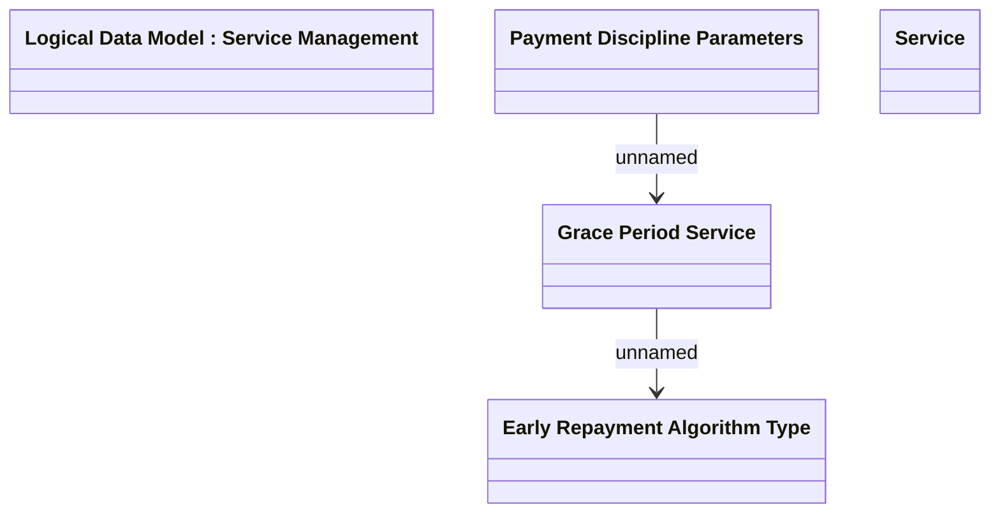

# Grace Period - Setting

```mermaid
classDiagram
    class Logical_Data_Model_Service_Management["Logical Data Model : Service Management"]
    class Payment_Discipline_Parameters["Payment Discipline Parameters"]
    class Grace_Period_Service["Grace Period Service"]
    class Early_Repayment_Algorithm_Type["Early Repayment Algorithm Type"]
    class Service["Service"]
    Grace_Period_Service --> Early_Repayment_Algorithm_Type : unnamed
    Payment_Discipline_Parameters --> Grace_Period_Service : unnamed
```
