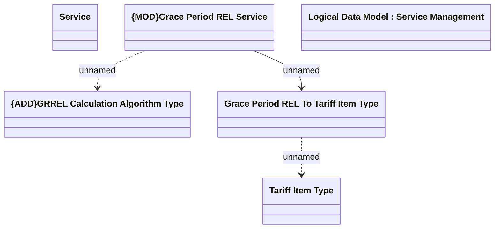

# Grace period for REL

- **Diagram Type**: Logical
- **Package**: HomerSelect/BSL/Modules/Product Catalog (PRC)/Analytical Model/Service/COMMON for Service/Logical Data Model/Service Type Specific Extension/GRREL
- **Diagram ID**: 155830
- **Elements**: 6
- **Connectors**: 3

