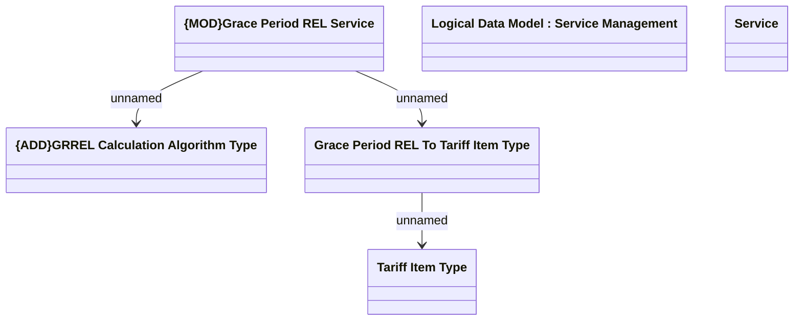

# Grace period for REL

```mermaid
classDiagram
    class ADD_GRREL_Calculation_Algorithm_Type["{ADD}GRREL Calculation Algorithm Type"]
    class Grace_Period_REL_To_Tariff_Item_Type["Grace Period REL To Tariff Item Type"]
    class Tariff_Item_Type["Tariff Item Type"]
    class MOD_Grace_Period_REL_Service["{MOD}Grace Period REL Service "]
    class Logical_Data_Model_Service_Management["Logical Data Model : Service Management"]
    class Service["Service"]
    Grace_Period_REL_To_Tariff_Item_Type --> Tariff_Item_Type : unnamed
    MOD_Grace_Period_REL_Service --> Grace_Period_REL_To_Tariff_Item_Type : unnamed
    MOD_Grace_Period_REL_Service --> ADD_GRREL_Calculation_Algorithm_Type : unnamed
```
