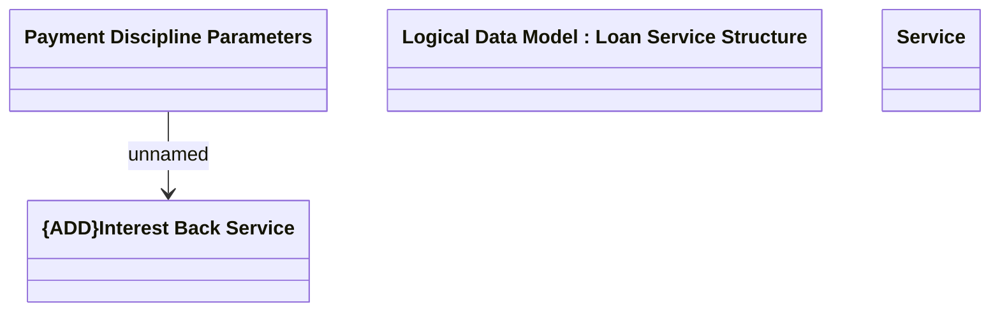

# IBACK

```mermaid
classDiagram
    class Payment_Discipline_Parameters["Payment Discipline Parameters"]
    class Logical_Data_Model_Loan_Service_Structure["Logical Data Model : Loan Service Structure"]
    class ADD_Interest_Back_Service["{ADD}Interest Back Service"]
    class Service["Service"]
    Payment_Discipline_Parameters --> ADD_Interest_Back_Service : unnamed
```
