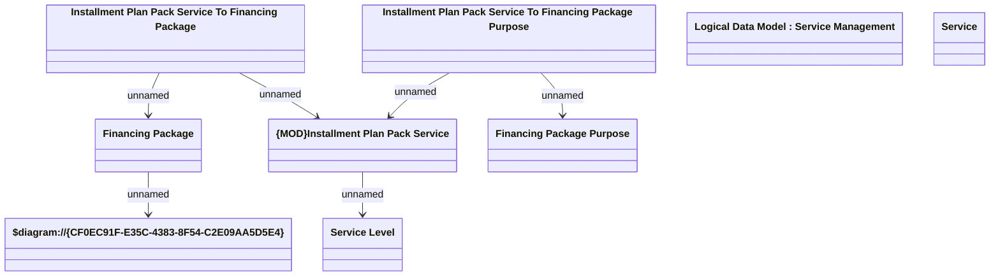

# Installment Plan Pack - Setting

```mermaid
classDiagram
    class Service_Level["Service Level"]
    class Financing_Package["Financing Package"]
    class diagram_CF0EC91F_E35C_4383_8F54_C2E09AA5D5E4["$diagram://{CF0EC91F-E35C-4383-8F54-C2E09AA5D5E4}"]
    class Installment_Plan_Pack_Service_To_Financing_Package["Installment Plan Pack Service To Financing Package"]
    class MOD_Installment_Plan_Pack_Service["{MOD}Installment Plan Pack Service "]
    class Financing_Package_Purpose["Financing Package Purpose"]
    class Installment_Plan_Pack_Service_To_Financing_Package_Purpose["Installment Plan Pack Service To Financing Package Purpose"]
    class Logical_Data_Model_Service_Management["Logical Data Model : Service Management"]
    class Service["Service"]
    Installment_Plan_Pack_Service_To_Financing_Package_Purpose --> Financing_Package_Purpose : unnamed
    Installment_Plan_Pack_Service_To_Financing_Package --> MOD_Installment_Plan_Pack_Service : unnamed
    Installment_Plan_Pack_Service_To_Financing_Package_Purpose --> MOD_Installment_Plan_Pack_Service : unnamed
    Financing_Package --> diagram_CF0EC91F_E35C_4383_8F54_C2E09AA5D5E4 : unnamed
    Installment_Plan_Pack_Service_To_Financing_Package --> Financing_Package : unnamed
    MOD_Installment_Plan_Pack_Service --> Service_Level : unnamed
```
