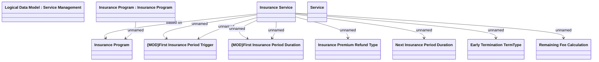

# Insurance Service

```mermaid
classDiagram
    class Remaining_Fee_Calculation["Remaining Fee Calculation"]
    class Early_Termination_TermType["Early Termination TermType"]
    class Next_Insurance_Period_Duration["Next Insurance Period Duration"]
    class Logical_Data_Model_Service_Management["Logical Data Model : Service Management"]
    class Insurance_Program_Insurance_Program["Insurance Program : Insurance Program"]
    class Insurance_Program["Insurance Program"]
    class Insurance_Premium_Refund_Type["Insurance Premium Refund Type"]
    class MOD_First_Insurance_Period_Duration["{MOD}First Insurance Period Duration"]
    class MOD_First_Insurance_Period_Trigger["{MOD}First Insurance Period Trigger"]
    class Insurance_Service["Insurance Service"]
    class Service["Service"]
    Insurance_Service --> MOD_First_Insurance_Period_Trigger : unnamed
    Insurance_Service --> MOD_First_Insurance_Period_Trigger : unnamed
    Insurance_Service --> MOD_First_Insurance_Period_Duration : unnamed
    Insurance_Service --> MOD_First_Insurance_Period_Duration : unnamed
    Insurance_Service --> Insurance_Premium_Refund_Type : unnamed
    Insurance_Service --> Insurance_Program : based on
    Insurance_Program_Insurance_Program --> Insurance_Program : unnamed
    Insurance_Service --> Next_Insurance_Period_Duration : unnamed
    Insurance_Service --> Early_Termination_TermType : unnamed
    Insurance_Service --> Remaining_Fee_Calculation : unnamed
```
