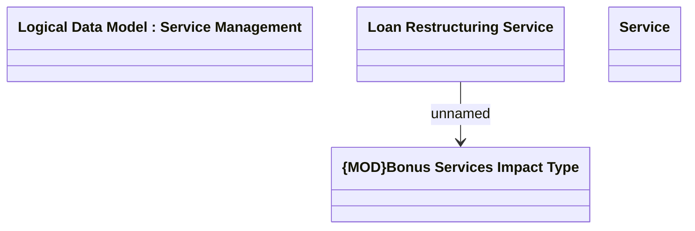

# Loan Restructuring - Setting

```mermaid
classDiagram
    class Logical_Data_Model_Service_Management["Logical Data Model : Service Management"]
    class MOD_Bonus_Services_Impact_Type["{MOD}Bonus Services Impact Type"]
    class Loan_Restructuring_Service["Loan Restructuring Service"]
    class Service["Service"]
    Loan_Restructuring_Service --> MOD_Bonus_Services_Impact_Type : unnamed
```
