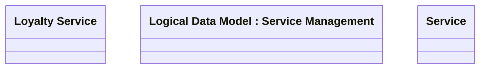

# Loyalty Service

```mermaid
classDiagram
    class Loyalty_Service["Loyalty Service"]
    class Logical_Data_Model_Service_Management["Logical Data Model : Service Management"]
    class Service["Service"]
```
