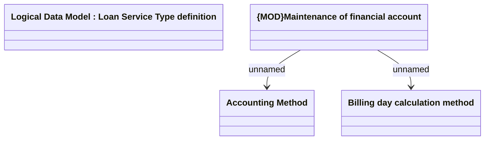

# MTCACC

```mermaid
classDiagram
    class Accounting_Method["Accounting Method"]
    class Billing_day_calculation_method["Billing day calculation method"]
    class Logical_Data_Model_Loan_Service_Type_definition["Logical Data Model : Loan Service Type definition"]
    class MOD_Maintenance_of_financial_account["{MOD}Maintenance of financial account"]
    MOD_Maintenance_of_financial_account --> Accounting_Method : unnamed
    MOD_Maintenance_of_financial_account --> Billing_day_calculation_method : unnamed
```
