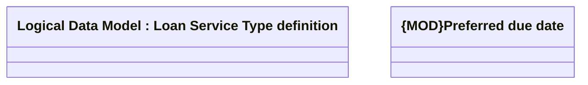

# PREFDD

```mermaid
classDiagram
    class Logical_Data_Model_Loan_Service_Type_definition["Logical Data Model : Loan Service Type definition"]
    class MOD_Preferred_due_date["{MOD}Preferred due date"]
```
