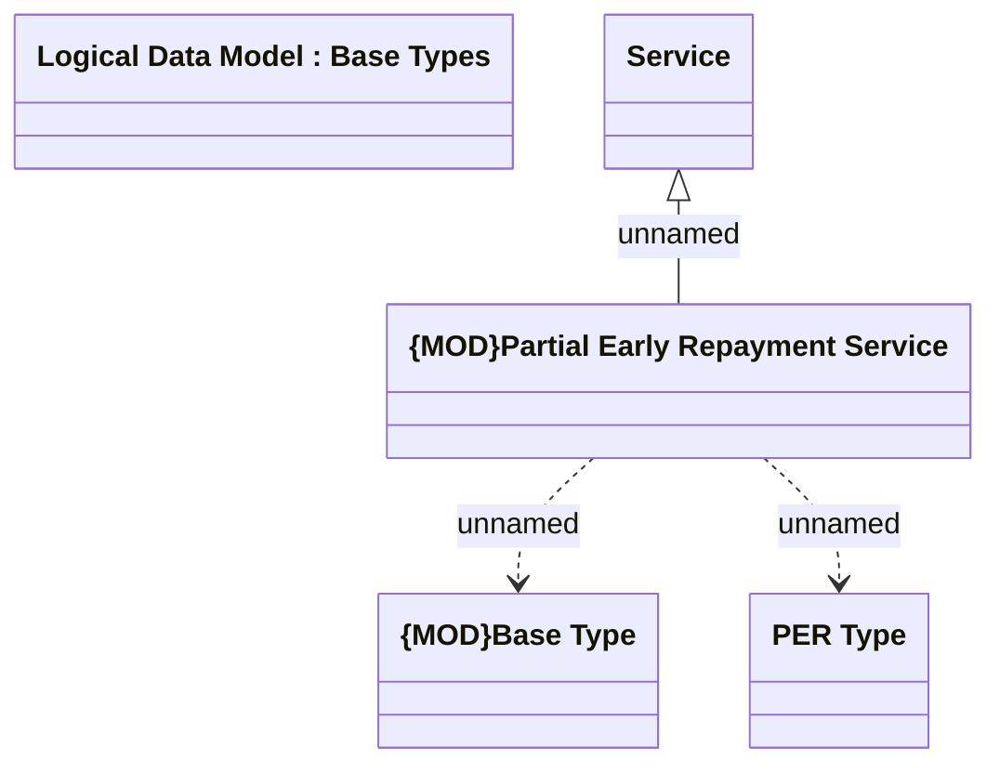

# Partial early repayment setting

- **Diagram Type**: Logical
- **Package**: HomerSelect/BSL/Modules/Product Catalog (PRC)/Analytical Model/Service/COMMON for Service/Logical Data Model/Service Type Specific Extension/PER
- **Diagram ID**: 163391
- **Elements**: 5
- **Connectors**: 3

