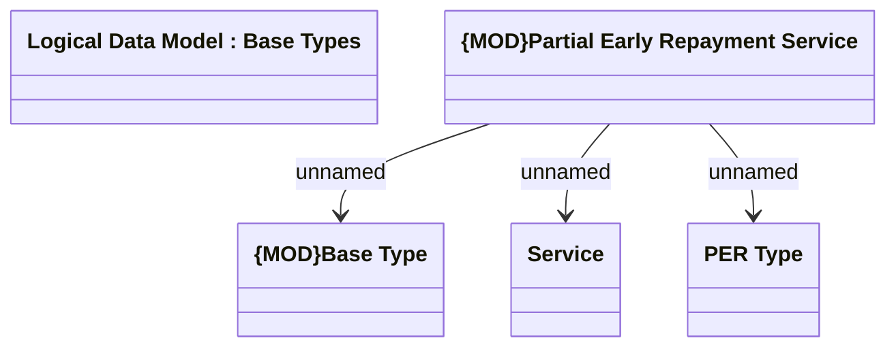

# Partial early repayment setting

```mermaid
classDiagram
    class Logical_Data_Model_Base_Types["Logical Data Model : Base Types"]
    class MOD_Base_Type["{MOD}Base Type"]
    class PER_Type["PER Type"]
    class MOD_Partial_Early_Repayment_Service["{MOD}Partial Early Repayment Service"]
    class Service["Service"]
    MOD_Partial_Early_Repayment_Service --> MOD_Base_Type : unnamed
    MOD_Partial_Early_Repayment_Service --> Service : unnamed
    MOD_Partial_Early_Repayment_Service --> PER_Type : unnamed
```
