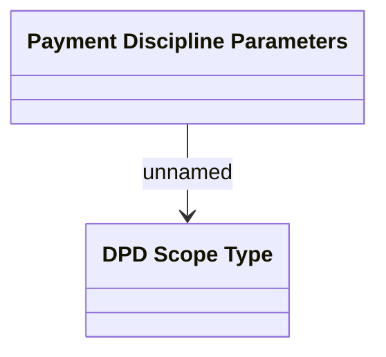

# Payment Discipline

```mermaid
classDiagram
    class Payment_Discipline_Parameters["Payment Discipline Parameters"]
    class DPD_Scope_Type["DPD Scope Type"]
    Payment_Discipline_Parameters --> DPD_Scope_Type : unnamed
```
