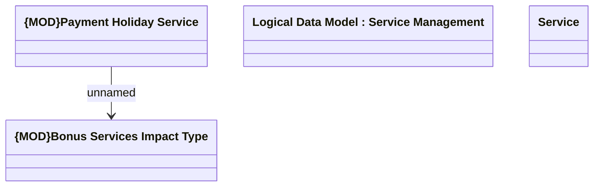

# Payment Holidays - Settting

```mermaid
classDiagram
    class MOD_Bonus_Services_Impact_Type["{MOD}Bonus Services Impact Type"]
    class MOD_Payment_Holiday_Service["{MOD}Payment Holiday Service"]
    class Logical_Data_Model_Service_Management["Logical Data Model : Service Management"]
    class Service["Service"]
    MOD_Payment_Holiday_Service --> MOD_Bonus_Services_Impact_Type : unnamed
```
