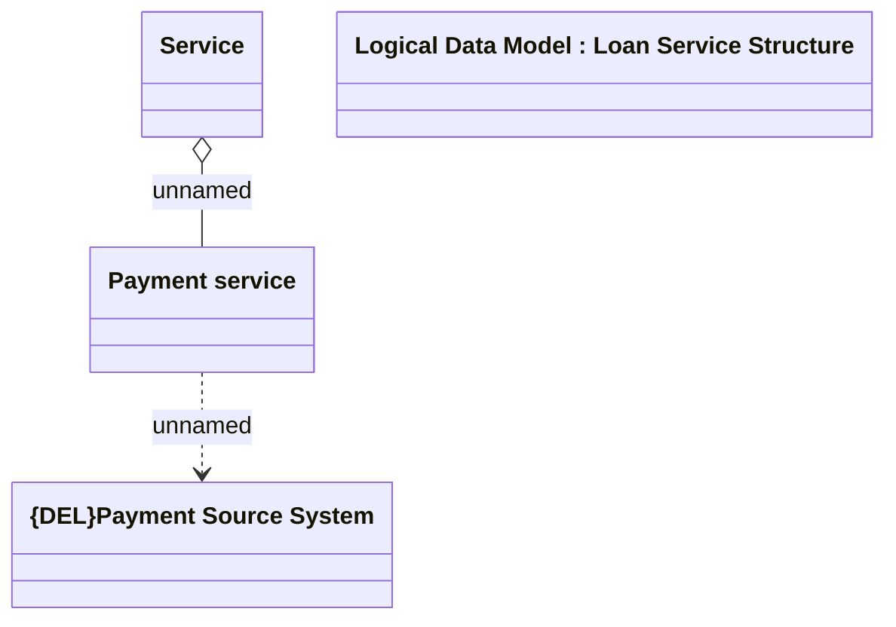

# Payment service - Settings

- **Diagram Type**: Logical
- **Package**: HomerSelect/BSL/Modules/Product Catalog (PRC)/Analytical Model/Service/COMMON for Service/Logical Data Model/Service Type Specific Extension/PAYM
- **Diagram ID**: 154728
- **Elements**: 4
- **Connectors**: 2

