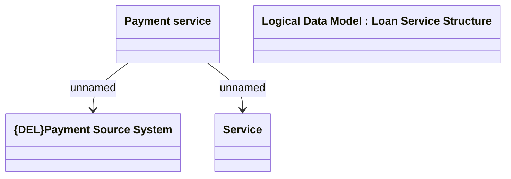

# Payment service - Settings

```mermaid
classDiagram
    class DEL_Payment_Source_System["{DEL}Payment Source System "]
    class Payment_service["Payment service"]
    class Logical_Data_Model_Loan_Service_Structure["Logical Data Model : Loan Service Structure"]
    class Service["Service"]
    Payment_service --> DEL_Payment_Source_System : unnamed
    Payment_service --> Service : unnamed
```
