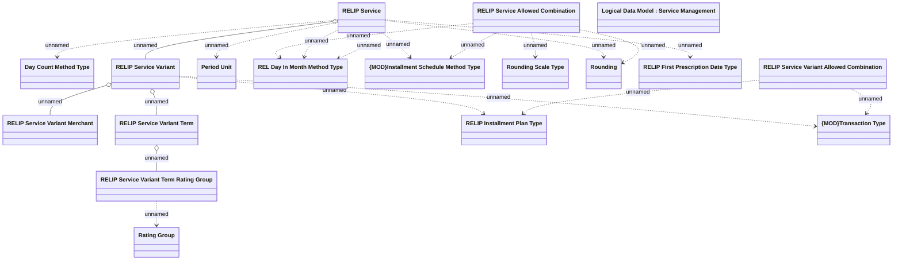

# REL Installment Plan service - parameters

- **Diagram Type**: Logical
- **Package**: HomerSelect/BSL/Modules/Product Catalog (PRC)/Analytical Model/Service/COMMON for Service/Logical Data Model/Service Type Specific Extension/RELIP
- **Diagram ID**: 103827
- **Elements**: 18
- **Connectors**: 20

