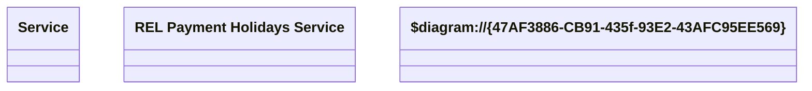

# REL Payment Holidays - Setting

- **Diagram Type**: Logical
- **Package**: HomerSelect/BSL/Modules/Product Catalog (PRC)/Analytical Model/Service/COMMON for Service/Logical Data Model/Service Type Specific Extension/RELPAYHOL
- **Diagram ID**: 128185
- **Elements**: 3
- **Connectors**: 0

