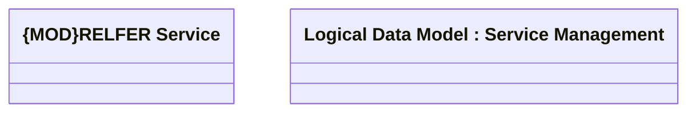

# RELFER

- **Diagram Type**: Logical
- **Package**: HomerSelect/BSL/Modules/Product Catalog (PRC)/Analytical Model/Service/COMMON for Service/Logical Data Model/Service Type Specific Extension/RELFER
- **Diagram ID**: 157792
- **Elements**: 2
- **Connectors**: 0

