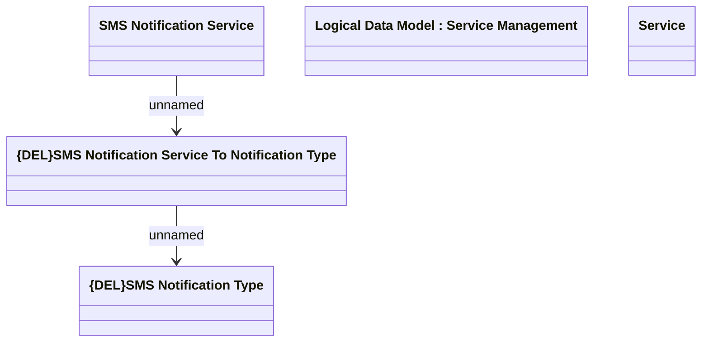

# SMS Notification

```mermaid
classDiagram
    class DEL_SMS_Notification_Type["{DEL}SMS Notification Type"]
    class DEL_SMS_Notification_Service_To_Notification_Type["{DEL}SMS Notification Service To Notification Type"]
    class SMS_Notification_Service["SMS Notification Service "]
    class Logical_Data_Model_Service_Management["Logical Data Model : Service Management"]
    class Service["Service"]
    SMS_Notification_Service --> DEL_SMS_Notification_Service_To_Notification_Type : unnamed
    DEL_SMS_Notification_Service_To_Notification_Type --> DEL_SMS_Notification_Type : unnamed
```
