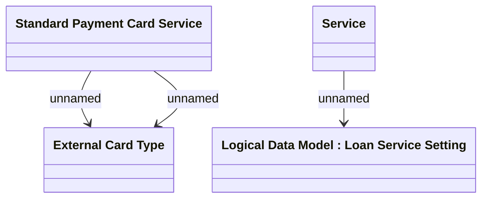

# Standard Payment Card

```mermaid
classDiagram
    class External_Card_Type["External Card Type"]
    class Logical_Data_Model_Loan_Service_Setting["Logical Data Model : Loan Service Setting"]
    class Standard_Payment_Card_Service["Standard Payment Card Service"]
    class Service["Service"]
    Standard_Payment_Card_Service --> External_Card_Type : unnamed
    Standard_Payment_Card_Service --> External_Card_Type : unnamed
    Service --> Logical_Data_Model_Loan_Service_Setting : unnamed
```
