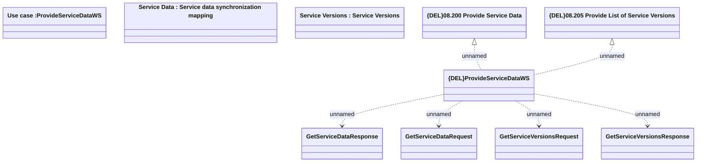

# ProvideServiceDataWS

- **Diagram Type**: Logical
- **Package**: HomerSelect/BSL/Modules/Product Catalog (PRC)/Analytical Model/Service/Provided Services/Interface Provided/ProvideServiceDataWS
- **Diagram ID**: 162785
- **Elements**: 10
- **Connectors**: 6

