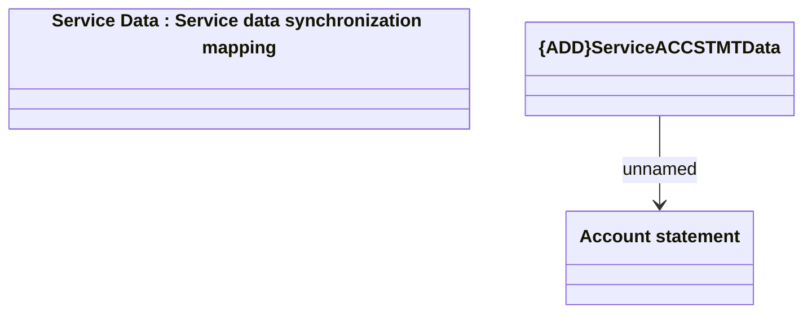

# Service ACCSTMT Data

```mermaid
classDiagram
    class Account_statement["Account statement"]
    class Service_Data_Service_data_synchronization_mapping["Service Data : Service data synchronization mapping"]
    class ADD_ServiceACCSTMTData["{ADD}ServiceACCSTMTData "]
    ADD_ServiceACCSTMTData --> Account_statement : unnamed
```
